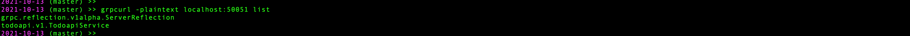
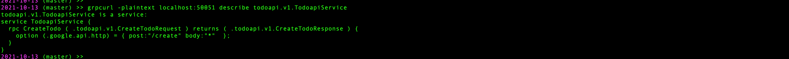
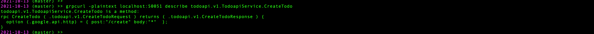
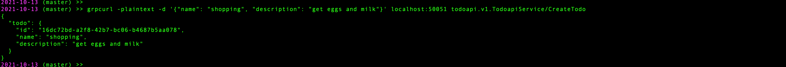
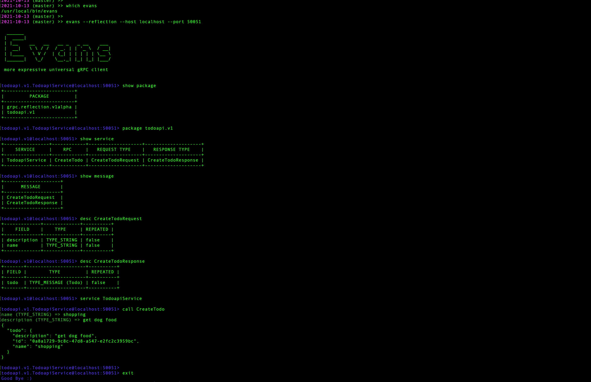
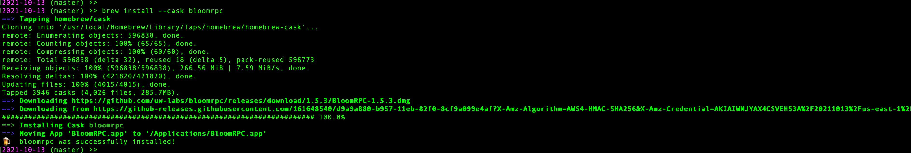
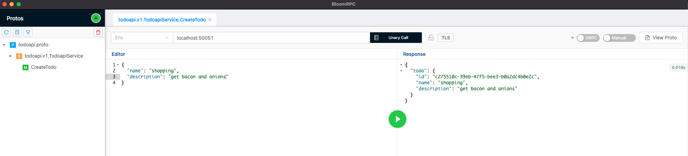
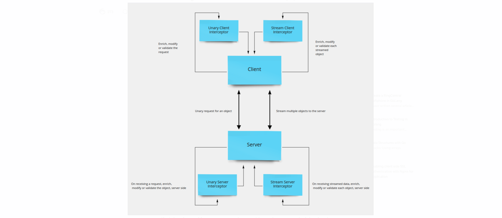
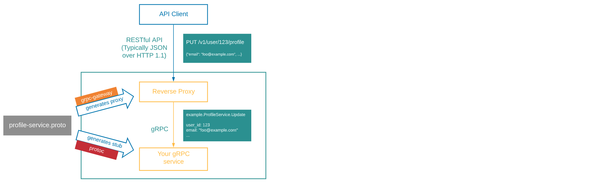

# GRPC, Meeting #2

## Notes from the meeting

* ~~What gRPC is and why/how it is used~~ // Covered: meeting #1

* Ecosystem/Tools/Implementation/Standards

  * ~~gRPC communication with protobuf encoding~~ // Covered: meeting #1

  * ~~Creating protobuf message and service definitions~~ // Covered: meeting #1

  * ~~Updating, versioning and maintaining backwards compatibility~~ // Covered: meeting #1

  * ~~Compiling the protobuf into client/server stubs~~ // Covered: meeting #1

  * gRPC server reflection
    * *[GRPC Server Reflection Protocol](https://github.com/grpc/grpc/blob/master/doc/server-reflection.md)*: Describes server reflection as an optional extension to assist runtime construction of requests without having stub information precompiled into the client
    * [Golang implementation](https://pkg.go.dev/google.golang.org/grpc@v1.41.0/reflection#section-readme)
      * Example: [Enabling server reflection in Go](https://github.com/grpc/grpc-go/blob/master/Documentation/server-reflection-tutorial.md#enable-server-reflection)
      * Question: What does it actually mean to "register" a gRPC service with a gRPC server?
        * <https://github.com/grpc/grpc-go/blob/a671967dfbaab779d37fd7e597d9248f13806087/server.go#L117-L141>
        * <https://github.com/grpc/grpc-go/blob/a671967dfbaab779d37fd7e597d9248f13806087/server.go#L625-L661>
    * The tools below will generally require *either* that you specify the location of your proto file(s) *or* that your gRPC server implements reflection: A tool like grpcurl needs one or other of those options available to it so it can "know" what RPCs your server supports and how they're defined.

  * Tools

    * **Exercise 1**: Create...
      * a simple proto file that defines an RPC server with one RPC;
        * *(You might find this helpful if you need a couple hints: <https://grpc.io/docs/languages/go/basics/#defining-the-service>)*
      * use `buf` to compile it locally;
        * *(You might find the `buf` docs helpful: <https://docs.buf.build/introduction>)*
      * import it into a `main.go` file and use it to create a simple gRPC server;
        * *(You might find this helpful if you need a couple hints: <https://grpc.io/docs/languages/go/basics/#server>)*
      * run the server on `localhost:50051`;
      * use that running server to try out 2-3 of the following CLI/GUI clients.
      * Suggestion: In the tradition of using a "todo" app to learn/practice new tech, perhaps the server could be...

            service TodoapiService {
              rpc CreateTodo(CreateTodoRequest) returns (CreateTodoResponse) {};
            }

    * [grpcurl](https://github.com/fullstorydev/grpcurl) (CLI): basic & serviceable; not much fun to use

      

      

      

      

    * [evans](https://github.com/ktr0731/evans) (CLI): as capable as grpcurl and less painful to use

      

    * [bloomrpc](https://github.com/uw-labs/bloomrpc) (GUI): a "Postman" style UI for gRPC

      

      

      

    * others... (Warning: Some of these are buggy or difficult to figure out how to use.)
      * [CLI tools](https://github.com/grpc-ecosystem/awesome-grpc#tools-cli)
      * [GUI tools](https://github.com/grpc-ecosystem/awesome-grpc#gui)

  * Unary vs streaming gRPC
    * [Unary](https://grpc.io/docs/what-is-grpc/core-concepts/#unary-rpc) (simple RPC)
      

    * [server](https://grpc.io/docs/what-is-grpc/core-concepts/#server-streaming-rpc) streaming
      

    * [client](https://grpc.io/docs/what-is-grpc/core-concepts/#server-streaming-rpc) streaming
      

    * [bidirectional](https://grpc.io/docs/what-is-grpc/core-concepts/#bidirectional-streaming-rpc) streaming
      

  * [Interceptors](https://blog.dsb.dev/posts/creating-grpc-interceptors-in-go/)

    

    * server side

      

      * Defining a [Server Unary Interceptor](https://pkg.go.dev/google.golang.org/grpc#UnaryServerInterceptor)

            type UnaryServerInterceptor func(ctx context.Context, req interface{}, info *UnaryServerInfo, handler UnaryHandler) (resp interface{}, err error)

        Note: ***"It is the responsibility of the interceptor to invoke [the] handler to complete the RPC"***

      * Defining a [Server Stream Interceptor](https://pkg.go.dev/google.golang.org/grpc#StreamServerInterceptor)

            type StreamServerInterceptor func(srv interface{}, ss ServerStream, info *StreamServerInfo, handler StreamHandler) error

      * Using a server interceptor: As a Server [ServerOption](https://pkg.go.dev/google.golang.org/grpc#ServerOption)
        * <https://pkg.go.dev/google.golang.org/grpc#NewServer>
        * In other words

              s := grpc.NewServer()

          becomes something like

              s := grpc.NewServer(
                grpc.UnaryInterceptor(MyServerInterceptor)
              )

    * client side

      

      * Defining a [Client Unary Interceptor](https://pkg.go.dev/google.golang.org/grpc#UnaryClientInterceptor)

            type UnaryClientInterceptor func(ctx context.Context, method string, req, reply interface{}, cc *ClientConn, invoker UnaryInvoker, opts ...CallOption) error

        Note: ***"When a unary interceptor(s) is set on a ClientConn, gRPC delegates all unary RPC invocations to the interceptor, and it is the responsibility of the interceptor to call invoker to complete the processing of the RPC"***

      * Defining a [Client Stream Interceptor](https://pkg.go.dev/google.golang.org/grpc#StreamClientInterceptor)

            type StreamClientInterceptor func(ctx context.Context, desc *StreamDesc, cc *ClientConn, method string, streamer Streamer, opts ...CallOption) (ClientStream, error)

      * Using a client interceptor: As a ClientConn [DialOption](https://pkg.go.dev/google.golang.org/grpc#DialOption)
        * <https://pkg.go.dev/google.golang.org/grpc#Dial>
        * In other words

              clientConn, err = grpc.Dial(address)

          becomes something like

              clientConn, err = grpc.Dial(
                address,
                grpc.WithUnaryInterceptor(MyClientInterceptor)
              )

      * Client interceptors come with the ability to invoke (a) `CallOption`(s).
        * What's a `CallOption`?
          * "CallOption configures a Call before it starts or extracts information from a Call after it completes"
          * <https://pkg.go.dev/google.golang.org/grpc#CallOption>
          * "For what it's worth, a CallOption from a user's perspective looks like not much... and that's why the before/after methods are private in the first place. Right now, we have the freedom to completely change how CallOptions are implemented internally with very few restrictions without breaking users... [A]dding an API may be easy, but it is very hard for us to change or remove bad APIs." *--Mehrdad Afshari, grpc core contributer*

    * **Exercise 2**: Modify the gRPC server to implement a Server Unary Interceptor that attempts to log the request and response headers any time *any* server endpoint gets hit. (Note: Part of this will may turn out to be unexpectedly tricky.)
      * Suggestion: As a first step, forget about the request/response header logging. First, just try to create a valid interceptor that does something dead simple like log "Hello world". Register it on your server and test it by running your server and using one of the CLI/GUI tools we tried out above to send it a request. If your interceptor works, you should see "Hello world" get logged in your server's log output.
      * You might find these blog articles helpful guides:
        * <https://shijuvar.medium.com/writing-grpc-interceptors-in-go-bf3e7671fe48>
        * <https://edgehog.blog/a-guide-to-grpc-and-interceptors-265c306d3773>
      * You might find this helpful as a reference for harvesting metadata: <https://github.com/grpc/grpc-go/blob/master/Documentation/grpc-metadata.md>
      * Question: This will be a *server* middleware interceptor. So should we be looking at "incoming" context or "outgoing" context to log our headers?
      * Question: The `response` is typed as an `interface{}`. Is there any way to access its internal structure (properties, methods) as we look for a way to get header info from it?
      * Question: Why use an interceptor? Couldn't we just do this stuff in the endpoint handler(s)? What can an interceptor do that an ordinary RPC handler function can't do?

    * **Exercise 3**: Suppose we want to add a 2nd server interceptor. Try it and see what happens: Add a 2nd interceptor that adds a new custom header to the request. (Be careful you don't accidentally over-write the existing headers, BTW.) Add it as another CallOption on the NewServer call. If something unexpected happens, see if you can find an alternative approach.

    * **Exercise 4**: Create a simple gRPC client that dials `localhost:50051` and sends a request to our server's endpoint. Then implement a client interceptor and try to use it to log response headers and/or trailers from the client side.
      * Suggestion: As a first step, forget about the response header logging. First, just try to create a valid interceptor that does something dead simple like in the 1st step for Exercise 2.
      * Note: This is a potentially tricky one. You could forget about the response headers/trailers and just do something different with this interceptor. Hint: Take a look at the CallOptions at your disposal.

  * Middleware

        In basic terms, the middleware is a software component in a distributed system that is used to connect different components to route requests generated by the client to the backend server. In gRPC Middleware, we are also talking about running code before and after the gRPC server or client application.

        In fact, gRPC middleware is based on the interceptor concept...

        -- https://learning.oreilly.com/library/view/grpc-up-and/9781492058328/ch08.html#idm46536629036824

    * Middleware libraries can offer ready-made options and interceptors you can use without having to create your own custom interceptors.
      * [Go gRPC Middleware](https://pkg.go.dev/github.com/grpc-ecosystem/go-grpc-middleware#section-readme)
        * See, for example <https://gitlab.gs.kount.com/kount/plat/examples/grpc-go-template/-/blob/master/cmd/grpc-go-template-server/main.go#L14-16>
      * Kount has developed middleware of its own, too
        * See, for example <https://gitlab.gs.kount.com/kount/plat/examples/grpc-go-template/-/blob/master/cmd/grpc-go-template-server/main.go#L21>

    * **Exercise 5**: Choose and add some middleware from `github.com/grpc-ecosystem/go-grpc-middleware` to your server from Exercise 3, or to your client from Exercise 4.

  * [gRPC-Gateway](https://grpc-ecosystem.github.io/grpc-gateway/docs/tutorials/introduction/)
    * Reads a gRPC service definition and generates a reverse-proxy server which translates a RESTful JSON API into gRPC
    
    * Why?
      * gRPC-Gateway [background](https://grpc-ecosystem.github.io/grpc-gateway/docs/overview/background/): "gRPC is great... However, you might still want to provide a traditional RESTful API as well."
      * example from etcd: [Why gRPC gateway](https://etcd.io/docs/v3.4/dev-guide/api_grpc_gateway/): "For languages with no gRPC support, etcd provides a JSON gRPC gateway. This gateway serves a RESTful proxy that translates HTTP/JSON requests into gRPC messages."
    * [Adding gRPC-Gateway annotations to an existing proto file](https://grpc-ecosystem.github.io/grpc-gateway/docs/tutorials/adding_annotations/)

    * **Exercise 6**: Add gRPC-Gateway to the proto file for your gRPC server from Exercise 3. Recompile using `buf`. Then add implement your server as a REST server using gRPC-Gateway running on localhost:8080. Test a REST request using `curl`, a browser, or Postman.

* Resources, links
  * [Awesome gRPC](https://github.com/grpc-ecosystem/awesome-grpc): *"A curated list of useful resources for gRPC"*
  * [A Guide to gRPC and Interceptors](https://edgehog.blog/a-guide-to-grpc-and-interceptors-265c306d3773) (blog article also referenced above in Exercise 2)
  * [gRPC Go: Beyond the basics](https://blog.gopheracademy.com/advent-2017/go-grpc-beyond-basics/), from Gopher Academy Blog: *"The purpose of this blog is to be a guideline for where to find the resources and leverage these libraries and features to make the most of the gRPC ecosystem after you understand the basics of gRPC"*

* Kount implementation and standards/patterns // Maybe meeting #2; more likely meeting #3
  * "Template" projects in GitLab `plat` group
  * The common server implementation patterns
    * gRPC only
    * gRPC (internal only) accessible via grpc-gateway REST
    * both gRPC *and* grpc-gateway REST
  * The Service Catalog
    * overview & usage
    * patterns
    * pipeline compilation
  * Commonly-used middleware in Kount gRPC servers
  * Resources, links
    * ...

* Common techniques & tasks, "gotchas", tips & tricks // Todo: approx. meeting #3-4
  * stubbing/mocking a gRPC server in a Go project

* {Case Studie(s)} // Optional: maybe meeting #5

* {"Class" exercise(s)} // Todo: approx. meeting #5-6
